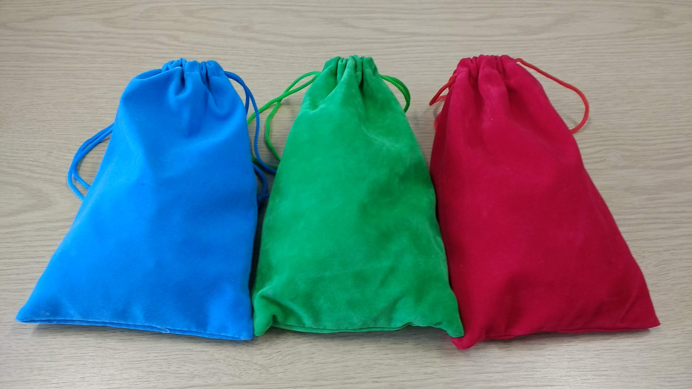
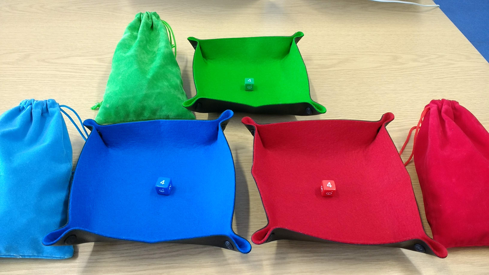
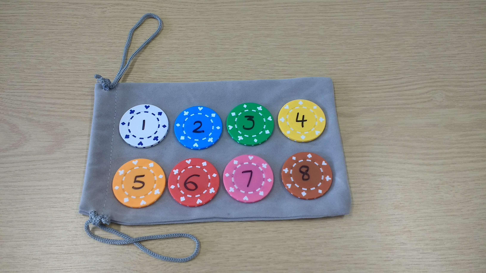
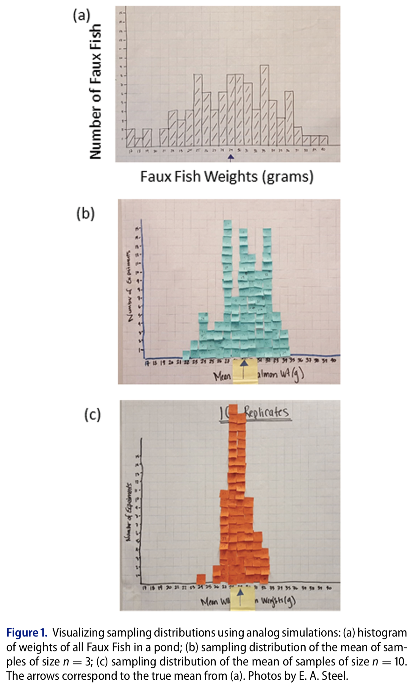
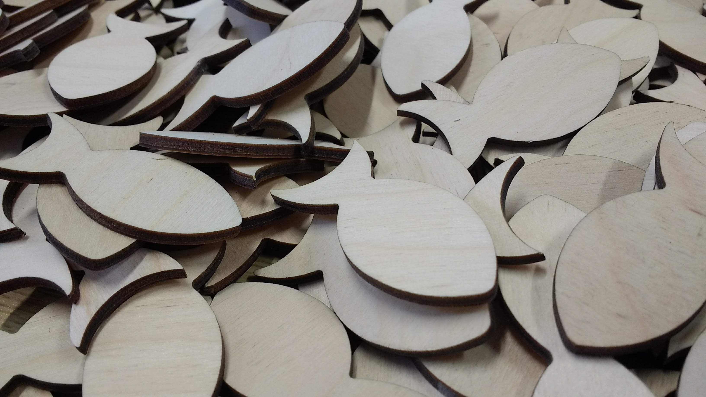
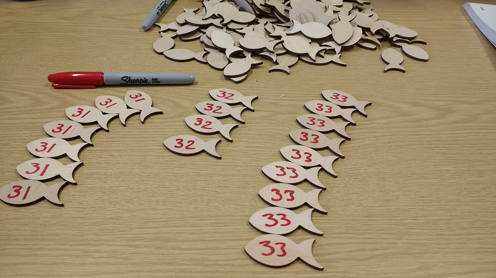
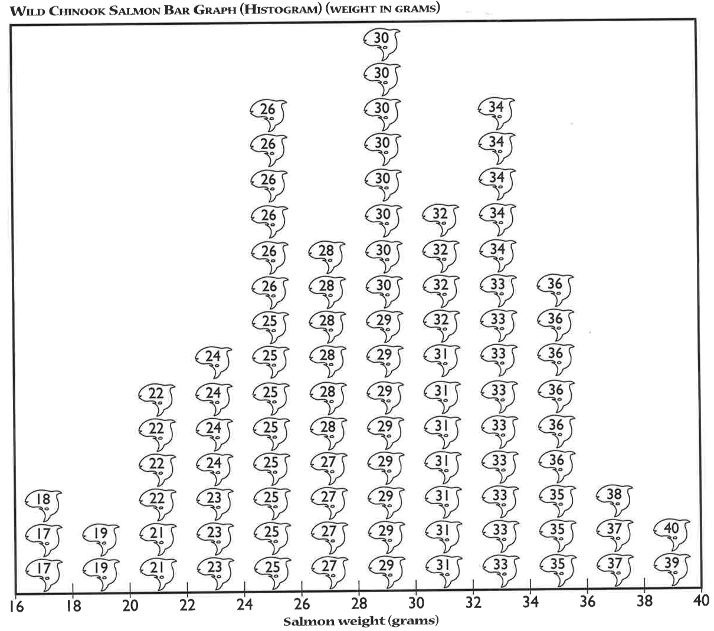
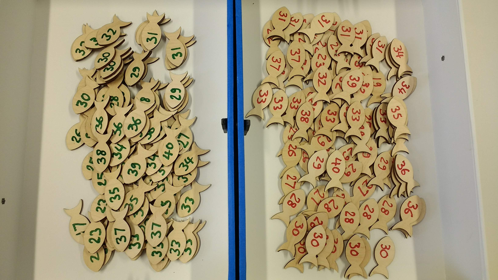

```{r setup, include=FALSE}
knitr::opts_chunk$set(echo = TRUE)
```

Analog class activities. The 3 main activities involve dice, poker chips and wooden fish, to explore different types of sampling, sampling distributions, the distinction between sample and population, resampling...

# Dependencies
```{r, message=FALSE, warning=FALSE}
library(tibble)
library(ggplot2)
```

# Activity 1: dice (hierarchical sampling)
We use dice to simulate sampling with replacement from an infinite population of participants and trials.

This exercise provides an opportunity to learn about:  
- the distinction between population and sample;  
- sampling with replacement;  
- hierarchical sampling;  
- running simulations;  
- estimation;  
- the distinction between finite and infinite populations.

Material:  
- 3 bags of dice  
- 3 trays (optional)  



Each bag contains a selection of dice with 4 to 20 facets, forming 3 independent populations. In this activity, we sample from each population and then use the samples to try to make inferences about the populations.

Here is the setup we will use in class:

- 3 participants or groups of participants are involved, each working independently with their own bag/population;  
- a dice is randomly picked from a bag (without looking inside the bag!) -- this is similar to randomly sampling a participant from the population;  
- the dice is rolled 5 times, and the results written down -- this is similar to randomly sampling trials from the participant;  
- perform the two previous steps 10 times, for a total of 10 participants x 5 trials = 50 trials.



These values are then entered into a text file and shared with the rest of the class. The text files are opened in R, and the main question is: is there evidence that our 3 samples of 10 participants x 5 trials were drawn from different populations? To simplify the problem, in a first step we average over trials, so we are left with 10 values from each group. The second step is to produce some graphical representation of the data. Then we can try various inferential statistics.

The exercise is performed in classes 1-4, to see how much variability we get between simulated experiments. During the last class, the populations and the sampling distributions are revealed.

Also, in this exercise, because the dice are sampled with replacement, the population has an infinite size. The content of each bag defines the probability of sampling each type of dice, but it is not the entire population, unlike in the faux fish activity (see below).

## Data capture

Enter the data in R or a text file: 5 rows (trials) and 10 columns (participants).

```{r, eval=FALSE}
# enter data in matrix with 5 rows, 10 columns:

dice_res <- matrix(NA, nrow = 5, ncol = 10)

dice_res[,1] <- c(,,,,)
dice_res[,2] <- c(,,,,)
dice_res[,3] <- c(,,,,)
dice_res[,4] <- c(,,,,)
dice_res[,5] <- c(,,,,)
dice_res[,6] <- c(,,,,)
dice_res[,7] <- c(,,,,)
dice_res[,8] <- c(,,,,)
dice_res[,9] <- c(,,,,)
dice_res[,10] <- c(,,,,)

# Save in a txt file:
write.table(dice_res, file = "./data/dice_res_blue.txt", row.names=FALSE, col.names=FALSE)
write.table(dice_res, file = "./data/dice_res_green.txt", row.names=FALSE, col.names=FALSE)
write.table(dice_res, file = "./data/dice_res_red.txt", row.names=FALSE, col.names=FALSE)
```

## Load simulated data
```{r}
nt <- 5 # number of trials
np <- 10 # number of participants
res_red <- matrix(scan("./data/res1.txt"), nrow=nt, byrow=TRUE)
res_green <- matrix(scan("./data/res2.txt"), nrow=nt, byrow=TRUE)
res_blue <- matrix(scan("./data/res3.txt"), nrow=nt, byrow=TRUE)
```

## Load real data
```{r, eval=FALSE}
res_red <- matrix(scan("./data/dice_res_red.txt"), nrow=nt, byrow=TRUE)
res_green <- matrix(scan("./data/dice_res_green.txt"), nrow=nt, byrow=TRUE)
res_blue <- matrix(scan("./data/dice_res_blue.txt"), nrow=nt, byrow=TRUE)
```

## Illustration of example data

### Mean results

For each bag, we compute the mean across trials/throws for each participant/dice:

```{r}
m.red <- apply(res_red, 2, mean) 
m.green <- apply(res_green, 2, mean)
m.blue <- apply(res_blue, 2, mean)
```

### Illustrate results
```{r}
foo <- median # name of summary statistic
set.seed(1) # reproducible scatterplot
# make data frame
df <- tibble(obs = c(m.red, m.green, m.blue),
             gp = factor(c(rep("Red",np),rep("Green",np),rep("Blue",np)))
             )

# preserve factor order
df$gp <- as.character(df$gp)
df$gp <- factor(df$gp, levels=unique(df$gp))

ggplot(df, aes(gp, obs)) + theme_linedraw() +
  geom_point(aes(colour = gp), size = 3,
             position = position_jitter(width = 0.1)) +
  scale_color_manual(values=c("red", "green4", "blue")) +
  theme(legend.position = "none",
        axis.text = element_text(size = 14),
        axis.title = element_text(size = 16)) +
  labs(x = "Groups", y = "Observations") +   
  coord_cartesian(ylim = c(0, 12)) +
  scale_y_continuous(breaks = seq(0, 12, 2)) +
  geom_errorbar(stat = "summary", 
                fun.y = foo, fun.ymin = foo, fun.ymax = foo, 
                colour = "grey", width = .55, size = 2, alpha = 0.5) +
  geom_errorbar(stat = "summary", 
                fun.y = foo, fun.ymin = foo, fun.ymax = foo, 
                colour = "black", width = .5, size = 0.75, alpha = 0.5)
```

# Activity 2: poker chips (bootstrap sampling with replacement)
We use poker chips to demonstrate sampling with replacement, as done in the bootstrap.

This exercise provides an opportunity to learn about:  
- sampling with replacement;  
- bootstrap sampling;  
- running simulations.

A bag contains 8 poker chips, representing the outcome of an experiment. Each chip is like an observation. 



First, we demonstrate sampling with replacement by getting a random chip from the bag, writing down its value, and replacing the chip in the bag. Second, we demonstrate bootstrap sampling by performing sampling with replacement 8 times, each time writing down the value of the random chip selected from the bag. In R, sampling with replacement is done using the `sample` function.

## R code
The core mechanism of the bootstrap is sampling with replacement, which is equivalent to simulating experiments using only the data at hand. Let's say we have a sample that is a sequence of integers, from 1 to 8.

```{r}
n <- 8 # sample size
samp <- 1:n
samp
```

To make bootstrap inferences, we sample with replacement from that sequence using the `sample()` function. That's the engine under the hood of any bootstrap technique. Let's generate our first bootstrap sample:

```{r}
set.seed(21) # for reproducible results
sample(samp, size = n, replace = TRUE) # sample with replacement
```

This call to the `sample` function is equivalent to getting a random poker chip from the bag, writing down the number, replacing the chip in the bag, and starting the process again, for a total of *n* times. The equivalent of selecting only one poker chip from the bag is to call `sample(samp, size = 1)`, but that's unnecessarily time consuming. 

We do it again, getting a different bootstrap sample:
```{r}
sample(samp, size = n, replace = TRUE) # sample with replacement
```

Third time:
```{r}
sample(samp, size = n, replace = TRUE) # sample with replacement
```

We could also generate our 3 bootstrap samples in one go:
```{r}
set.seed(21) # reproducible example
nboot <- 3
matrix(sample(samp, size = n*nboot, replace = TRUE), nrow = nboot, byrow = TRUE)
```

As is apparent from these 3 examples, in a bootstrap sample, some observations are sampled more than once and others are not sampled at all. So each bootstrap sample is like a virtual experiment in which we draw random observations from our original sample. 

# Activity 3: faux fish (sampling distributions)
We sample with replacement from a finite population of faux fish to demonstrate the effect of sample size on the shape of sampling distributions.

The faux fish activity is mentioned in Steel, Liermann & Guttorp (2019), with pictures of class results. The activity is described in detail in Kelsey & Steel (2001).



This exercise provides an opportunity to learn about:  
- the distinction between population and sample;  
- sampling with replacement;  
- running simulations;  
- estimation;  
- sampling distributions.

Material:  
- two sets of 97 faux fish = fish-shaped bits of paper or other material  
- two containers = ponds  
- two large blank sheets of paper  
  - x axis = 'Mean weight (g)'  
  - y axis = 'Number of experiments'  
  - titles = 'n=3 replicates' / 'n=10 replicates'  

Here is the code to generate empty axes for printing:

## Sheet 1
```{r, eval=FALSE}
df <- tibble()
p <- ggplot(df) + geom_point() + theme_linedraw() +
        labs(x = 'Mean weight (g)', y = 'Number of experiments') +
        theme(title = element_text(size = 20),
              axis.title = element_text(size = 18),
              axis.text = element_text(size = 16)) +
        scale_x_continuous(minor_breaks = seq(17, 40), limits = c(17, 40)) +
        scale_y_continuous(minor_breaks = seq(1, 30), limits = c(0, 30)) +
        ggtitle('n=3 replicates')
p
ggsave(file="template_n3.pdf", width = 420, height = 297, units = "mm")
```

## Sheet 2
```{r, eval=FALSE}
p <- p + ggtitle('n=10 replicates')
p
ggsave(file="template_n10.pdf", width = 420, height = 297, units = "mm")
```



Each faux fish has a weight in grams written on it.



The frequencies of the weights is given in Kelsey & Steel (2001).



The fish population is stored in a box. Two identical populations are available, so that two groups can work in parallel.



The first goal of the exercise is to produce sampling distributions by sampling with replacement from a population. The second goal is to evaluate the effect of the sample size on the shape of the sampling distribution. The third goal is to experiment with a digital version of the analog task, to gain familiarity with simulations.

Unlike the dice activity, this activity involves a finite size population: each box contains the full population under study.

Setup:  
- two groups of participants;  
- each group is assigned a box;  
- participants from each group take turn sampling from the box *n*=3 or *n*=10 faux fish (depending on the group), without looking inside the box;  
- each participant averages the numbers, writes down the answer and marks it on the large sheet of paper assigned to each group;  
- this is repeated until a sufficient number of simulated experiments have been carried out to assess the shape of the resulting sampling distribution.

To speed up the exercise, a participant picks *n* fish, writes down the weights, puts all the fish back in the box, and passes the box to the next participant. While the next participant is sampling fish from the box, the previous participant computes the mean and marks the result on the group graph.

Once done, we discuss the results by comparing the sampling distributions.

We can do the same in R, but much quicker!

## Simulate the faux fish sampling task

### Define population
```{r}
ffpop <- c(17, 17, 18, 19, 19, 21, 21, 22, 22, 22, 22, 23, 23, 23, 24, 24, 24, 24,
           25, 25, 25, 25, 25, 25, 25, 25, 26, 26, 26, 26, 26, 26, 
           27, 27, 27, 27, 28, 28, 28, 28, 28, 28, 29, 29, 29, 29, 29, 29, 29, 29, 
           30, 30, 30, 30, 30, 30, 30, 30, 31, 31, 31, 31, 31, 31, 31,
           32, 32, 32, 32, 33, 33, 33, 33, 33, 33, 33, 33, 33, 34, 34, 34, 34, 34,
           35, 35, 35, 36, 36, 36, 36, 36, 36, 37, 37, 38, 39, 40)
```

### Simulate
```{r}
set.seed(21)
n <- 3 # sample size
nexp <- 100 # number of experiments
# sampling distribution
ffsp <- apply(matrix(sample(ffpop, n*nexp, replace = TRUE), nrow = nexp), 1, mean)

df <- tibble(x = ffsp) # make data frame

ggplot(df, aes(x = x)) + theme_bw() +
  # superimpose population mean
  geom_vline(xintercept = mean(ffpop)) +
  geom_dotplot(binwidth = 1, fill = "white", 
               dotsize = 1, method = "histodot") +
  labs(x = 'Mean weight (g)', y = 'Number of experiments') +
  theme(title = element_text(size = 20),
        axis.title = element_text(size = 18),
        axis.text = element_text(size = 16)) +
  scale_x_continuous(minor_breaks = seq(17, 40), limits = c(17, 40)) +
  scale_y_continuous(minor_breaks = seq(1, 30), limits = c(0, 30)) +
  coord_fixed(ratio = 1) +
  ggtitle(paste0('n=',n,' replicates'))

# save figure
# ggsave(file=paste0('simres_n',n,'.pdf'), width = 6, height = 6)
```

# References
Kelsey, Kathryn, and Ashley Steel. **The Truth about Science: A Curriculum for Developing Young Scientists**. NSTA Press, 2001.

Steel, E. Ashley, Martin Liermann, and Peter Guttorp. **Beyond Calculations: A Course in Statistical Thinking**. The American Statistician 73, no. sup1 (29 March 2019): 392–401. https://doi.org/10.1080/00031305.2018.1505657.
